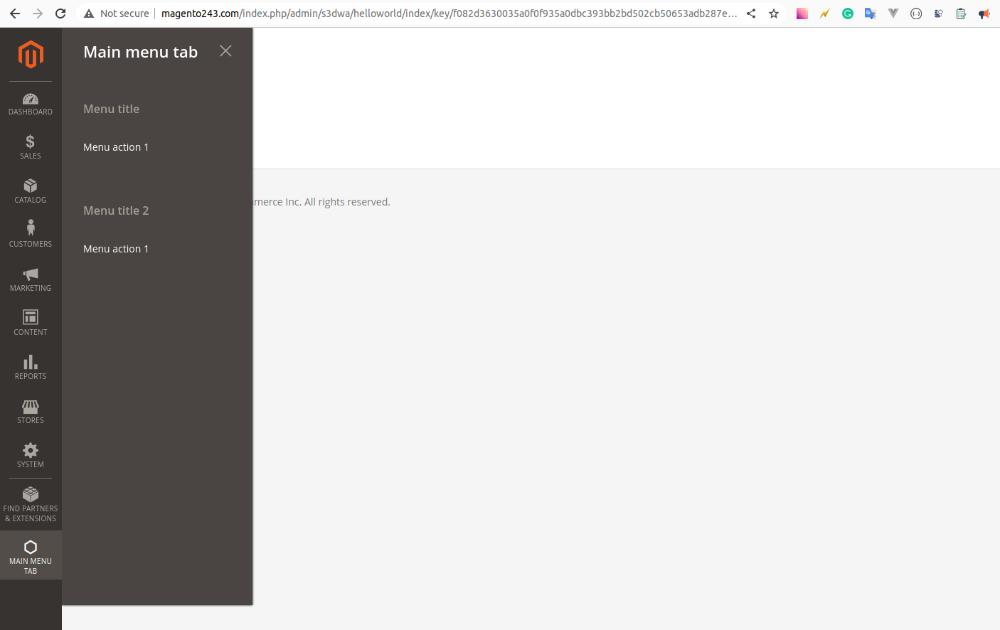

# Create an admin page
1.    We start with adding etc/adminhtml/menu.xml<br>
      inside this file we add a menu node that takes add, remove and update nodes.<br>
      For more details check the xsd file responsible for validating the menu.xml file<br>
      Options for these nodes can be:
- <b>id</b> unique identifier of the added node
- <b>title self-explanatory</b>
- <b>module</b> name of the module responsible for adding this item
- <b>parent</b> id of the parent add node for which this node will be under
- <b>sortOrder</b> self-explanatory
- <b>dependsOnModule</b> will hide if the mentioned module is disabled
- <b>resource</b> ACL resource to control which admin users have access to this
- <b>action</b> url to the controller that will handle the action
- <b>translate</b> to translate example title
- <b>dependsOnConfig</b> core config data to enable/disable this menu item
- <b>toolTip</b> self-explanatory
- <b>target</b> can be set to _blank if you want to open a new tab for the action link

<b>NB: If you add a second level menu item that has no children or that does not have sibling items then it won't show. <br> In our example menutitle will not show if it didn't have a child menuaction1 or a sibling menutitle2</b>
<br><br>
<b>NB: Make sure to declare the ALC resources or things will not show</b>

2.  Create a controller to handle the action under ```Controller/Adminhtml/RouteFrontName/ControllerClass.php```<br>

The controller should extend the ``` Magento\Backend\App\Action```  class and implement  ``` Magento\Framework\App\Action\HttpGetActionInterface ``` .<br>
As far as I know the HttpGetActionInterface is to enforce that this controller should only handle get requests.<br>

Then we use  ``` Magento\Framework\View\Result\PageFactory ```  to return a result page.

3.  Create a layout file for the url and a templates file for the contents of the page.<br>
    Under ```view/adminhtml``` create 2 folders templates and layout.<br>
    layout will include the xml file for the specific action url. The name takes the following format. ``` routeid_controllerfoldername_controllerclassname```<br>
    the templates file can have any name it's injected inside the xml layout file<br>
    <b>NB: The name of the layout file uses the route id</b><br>



<b>References https://developer.adobe.com/commerce/php/tutorials/admin/create-admin-page/</b>
